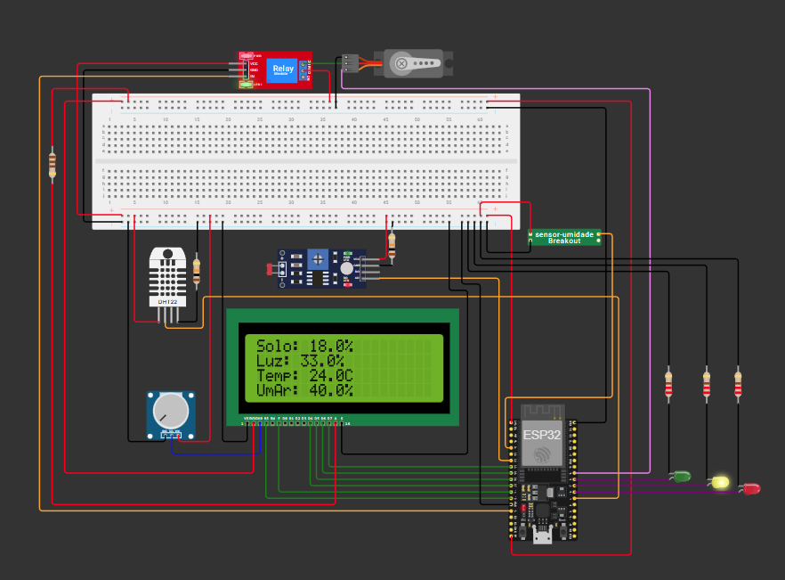

# 🌱 Projeto IoT: Irrigação Automática com ESP32

Este repositório contém o **projeto final da disciplina de IoT (Internet of Things)** do curso de Engenharia da Computação da UNIVAP (2025).  
O sistema implementa **irrigação automática** utilizando **ESP32**, com sensores de umidade do solo, fotorresistor e bomba de água, e comunicação com dashboards para monitoramento em tempo real.

O projeto é uma evolução do repositório anterior: [Sensor de Umidade](https://github.com/lauratrigo/Sensor_de_Umidade).  

📺 [Assista à demonstração do projeto](https://youtu.be/4Wo2KyQJo5k)  
💻 [Simulador Wokwi](https://wokwi.com/projects/447360622028577793)

---

## 🛠 Tecnologias Usadas

- **ESP32**  
- **Sensores**: sensor de umidade do solo, fotorresistor  
- **Atuadores**: bomba de irrigação, relé, LED  
- **MQTT** para comunicação com plataforma em nuvem (ThingsBoard)  
- **PlatformIO / Arduino IDE** para desenvolvimento do firmware  
- **Wokwi** para simulação do circuito  

  


---

## 📊 Sensores e Dados Coletados

- **Umidade do Solo** (%)  
- **Luminosidade (LDR)** (LUX)  
- **Temperatura e Umidade do Ar** (se disponível)  
- **Controle da Bomba** (on/off)  

💡 **Objetivo:** Monitorar parâmetros ambientais e controlar automaticamente a irrigação do solo, com acionamento remoto e visualização em dashboards.

---

## 📂 Estrutura do Projeto

```bash
projeto_iot/
├── Código conexão wi-fi.cpp
├── Código criptografado.cpp
├── INIC - IoT (Internet das Coisas).pdf
├── images/
│ ├── simulador.png
├── Simulador/
│ └── projeto IoT (sensor de umidade + bomba de irrigação automática + sensor fotorresistor)/
│ ├── diagram.json
│ ├── libraries.txt
│ ├── sensor-umidade.chip
│ ├── sketch.ino
│ └── wokwi-project.txt
└── README.md
```

---

## ⚙️ Como Executar

1. Clone o repositório:

```bash
git clone https://github.com/seuusuario/projeto_iot.git
cd projeto_iot/Simulador/projeto\ IoT\ \(sensor\ de\ umidade\ +\ bomba\ de\ irrigação\ automática\ +\ sensor\ fotorresistor\)/
```

2. Abra o **sketch.ino** na Arduino IDE ou PlatformIO.

3. Configure sua rede Wi-Fi e, se necessário, dados de criptografia no arquivo `Código conexão wi-fi.cpp`.

4. Compile e faça upload para o **ESP32**.

5. (Opcional) Teste a simulação online no Wokwi:  
   [Simulador Wokwi](https://wokwi.com/projects/447360622028577793)

---
## 📈 Dashboards e Resultados

- Monitoramento em tempo real da **umidade do solo** e **luminosidade**  
- Acionamento automático da **bomba de irrigação**  
- Sistema escalável para inclusão de novos sensores e atuadores  

<div align="center">
  
  <p>Print do simulador do projeto IoT</p>
</div>

---

## 📄 Artigo do INIC - Relatório

O relatório completo do projeto está disponível em formato PDF:  
`INIC - IoT (Internet das Coisas).pdf`

---

## 🤝 Agradecimentos

Projeto desenvolvido como **trabalho final da disciplina de IoT** no curso de Engenharia da Computação da UNIVAP, com orientação do Prof. Wagner Santos.

---

## 📜 Licença

Este projeto está licenciado sob **MIT License**. Consulte o arquivo LICENSE para mais informações.
